# 월급루팡하면서 쓰게되는 뉴비 템세팅 가이드

## 서론

예전에 념글을 갔었는데 너무 조잡해보이는 글이여서 다시 쓰기로 결심을 했고, 프로젝트때문에 시간이 없어서 차일피일 미루다가 이제서야 쓰게 됐음.

늒네들이 도움이 됐으면 좋겠다.
참고로, 파르홀른같은 경우에는 저는 1캐릭충이라 안해서 겜알못이 쓴 글이라 생각하고 이해 좀 부탁드립니다. 

## 목차
1. 100 레벨 이전
    + 길드 
    + 필수적으로 진행해야할 컨텐츠
        + 일간
        + 주간

2. 템 세팅 가이드
    + 무기
    + 악세
    + 수호부
    + 방어구

## 1. 캐릭터를 육성하면서 꼭 챙겨야하는 것들
### 길드

일단, 이 게임은 길드가 너무너무 중요함. 혹시라도 1렙 때 아 일단은 찍먹해봐야지하는 심정으로 길드 없이 진행하지말고, 갤 길드 가입을 한 뒤에 진행하도록 하자.

갤 길드 리스트는 아래와 같음

1. [노블](http://heroes.nexon.com/community/guild/agitmain?guildno=1459619530)
2. [켈트](http://heroes.nexon.com/community/guild/agitmain?guildno=636826907201376036)
3. [길사대](http://heroes.nexon.com/community/guild/agitmain?guildno=1677723814)
4. [날먹충](http://heroes.nexon.com/community/guild/agitmain?guildno=637200223162076956)
5. [유리검](http://heroes.nexon.com/community/guild/agitmain?guildno=201894)
6. [자스민](http://heroes.nexon.com/community/guild/agitmain?guildno=1476396586)
7. [지약린](http://heroes.nexon.com/community/guild/agitmain?guildno=1392511013)
8. [만화경](http://heroes.nexon.com/community/guild/agitmain?guildno=1912604653)
9. [황홀경](http://heroes.nexon.com/community/guild/agitmain?guildno=1358954501)
10. [삐약새](http://heroes.nexon.com/community/guild/agitmain?guildno=1207961699)
11. [노라이퍼](http://heroes.nexon.com/community/guild/agitmain?guildno=234882794)
12. [둥글둥글](http://heroes.nexon.com/community/guild/agitmain?guildno=838862761)
13. [온새미로](http://heroes.nexon.com/community/guild/agitmain?guildno=335546148)
14. [하실래요](http://heroes.nexon.com/community/guild/agitmain?guildno=1660946590)
15. [같이걷는길](http://heroes.nexon.com/community/guild/agitmain?guildno=1107298267)
16. [전국지약캐협회](http://heroes.nexon.com/community/guild/agitmain?guildno=1174407049)
17. [말랑푹신뜸부기](http://heroes.nexon.com/community/guild/agitmain?guildno=637225623581298388)
18. [모리안그계집은멍청하고생각이없어](http://heroes.nexon.com/community/guild/agitmain?guildno=1291846933)

갤길드 선택 방법은 너가 선택하는 거임. 망갤에 검색을 해보든 해서 자신과 맞을 거 같은 길드에 들어가자.

그 후에 위의 길드 이름을 클릭하면 링크 들이 달려있는데 가입신청 후 저 링크를 클릭하면 운영진 이름들이 있을거야 이름들 순차적으로 귓속말해보고 없으면 갤에서 호출해보자.

그렇다면 왜? 길드에 꼭 들어가야하는지 설명하겠음.

## 1. AP 부족을 극복할 수가 있다. 
## 2. 길드스킬를 통하여 보다 안정적인 육성 및 초기 자금 마련이 가능하다.
## 3. 길드던전, 길사대 컨텐츠를 통하여 보다 안정적인 육성이 가능하다.
## 4. 템세팅 및 향후 육성 가이드라인을 고인물에게 제시 받을 수 있다.

가입을 했다는 가정하에 서술해보겠음.
최초 접속 시 'Y'키를 누르면 길드 정보 창이 나올 것임.

그 중에 우리가 눈 여겨 봐야하는 것은 **'길드임무'** 임.

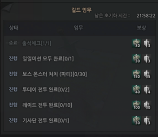

보상에서 GP라고 적힌 부분이 있고, 옆에 칼과 방패 모양의 인장이 있을거야.
우리는 이것을 이틀에 적어도 **52개**를 모으는 것이 목표야.

이것을 모아서 어디다 쓰느냐?

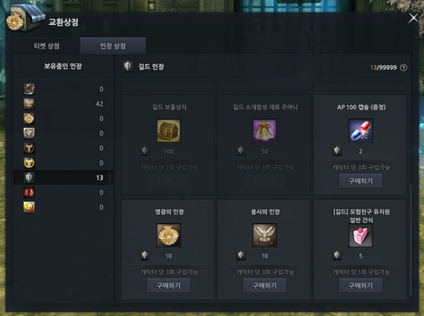

바로 인장 상점에서 교환을 할 수 있음.
일단, 우선 순위는 내 생각에는 빠른 보급 셋과 아티팩트를 맞추기 위해서 **용사의 인장 > 영광의 인장 > AP 100 캡슐** 순으로 교환하는 것을 추천함. 

이 것은 취향이 갈리는 부분이라 나는 AP가 우선이다 하면 AP 캡슐을 먼저 사용한 뒤에 그 후에 **용인, 영인** 등으로 바꿔도 됌.

아티팩트는 나중에 아레나작으로도 딸 수 있으니 영광의 인장은 빼먹더라도 적어도 용인은 계속해서 바꿔주자. 

그 이유는 어떻게 왤까?

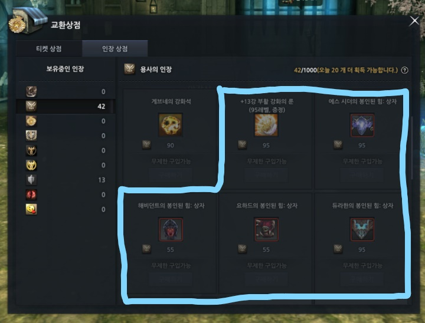

나중에 따로 설명을 하겠지만 용사의 인장이 총 **300개**가 필요해 따라서, 꾸준히 용인을 수급하는 것이 현명하다 볼 수 있다.

따라서, 길드 임무 완수를 통해서 육성 구간에서는 레이드 전투빼고는 거의 모든 길드 임무가 자연스럽게 완수가 될 수 있게끔 하는게 좋음.

### 그러면? 길드 임무를 제외하고 용사의 인장을 수급할 곳은 없나?

일단, 용사의 인장은 일일 획득 제한이 **20개** 로 제한이 되어있고 이를 얻는 방법은 [파티 권장]이라고 적힌 **레이드 전투**를 수행할 시 얻을 수 있음. 

아직 보급 악세를 받지 않은 입장에서 바라보면 **8(4종 2순 : 듀라한 / 에스시더 / 아르카나 / 루파티쿠스)** 과 기사단에서 하루에 총 10개의 용인을 모을 수가 있음.

하지만, 이러한 일일 획득 제한과 상관 없이 용인을 획득할 수 있는 곳이 있는데 그곳들을 알려주고자 함.

### 1. 기사단

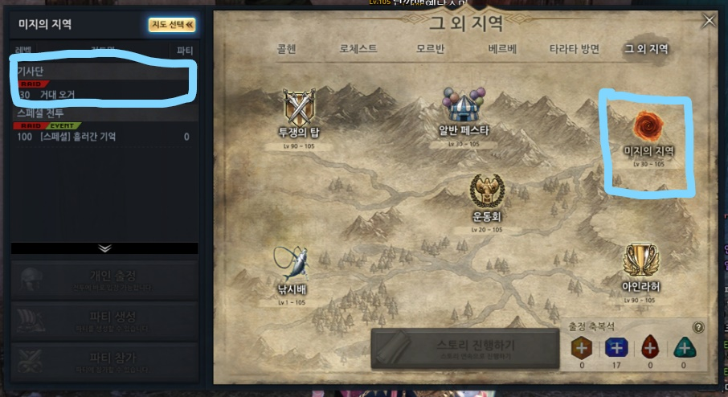

기사단은 레벨 30 이후에 치룰 수 있는 대규모 레이드 컨텐츠다.

레이드 보상으로는 **미지의 유리병** 이 나오는데 이 유리병이 레벨마다 보상이 다르다고 볼 수 있음. 그 중 우리가 눈 여겨봐야하는 유리병은 **미지의 유리병 (레벨 40)** 이다.

여기에서는 일일 획득 제한과 관계없이 무조건적으로 용인 1개를 획득할 수가 있음. 평균적으로 2개가 떨어진다고 가정했을 때, 4개의 용인을 획득 한다고 볼 수 있음.

따라서, 클리어 인장 2개 + 4개 = 하루 평균 **6개**의 용인이 획득 가능하다고 보면 됌.

### 2. 투쟁의 탑

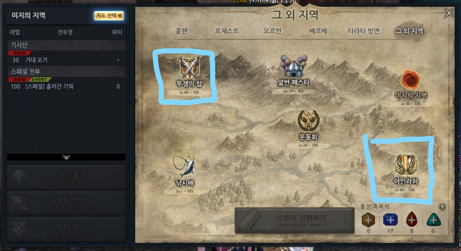

레벨 90부터 진입이 가능한 투쟁의 탑은 뉴비를 위한 전투라고 볼 수 있어. 

일단, 준수한 클골과 AP 그리고 많은 용인까지 드랍하는 전투라서 90레벨 이후 뉴비는 필수적으로 돌아야하는 전투야

투쟁의 탑은 용인 일일 획득 제한과 상관 없이 **용인 획득이 가능**해서 용인이 부족한 뉴비면 무조건적으로 돌아야한다고 생각함.

평균적으로 **판당 7개 드랍**을 하고, 하루에 4판이 가능하니, **28개**정도를 수급할 수가 있다고 보면 됌.

### 3. 아인라허

아인라허는 갤에서는 일명 **레후**라고 불리고 나중에 너가 스펙을 올리기 위해서 대리를 하던 직접 하던 필수적으로 돌아야할 컨텐츠라고 볼 수 있음. 

용인만 생각하는 입장에서, 아인라허 같은 경우에는 오늘의 전투 1회 클리어시 명예의 인장 1개를 획득 할 수 있으며, 동메달은 1개, 은메달은 2개, 금메달은 3개가 획득 가능함.

만약 너가 금메달로 오늘의 전투를 마무리하면 합연산으로 판당 **7개**의 용인을 획득할 수 있다고 보면 되고, 명예의 인장으로는 1:1로 용사의 인장과 교환상점에서 교환 가능하니 교환하도록 하자.

하지만, 숙달되지 않은 뉴비 입장에서는 머리싸매고 금메달 따느니 클리어하고 용인 1개 딴다는 마인드가 더 바람직하니 시간 낭비하지말고 빠르게 클리어한다고 생각하자 

## 그러면 100렙 이전에 필수적으로 진행해야될 컨텐츠들은?

1. 일간 컨텐츠

일단, 길드를 들어가는 이유 중에 가장 큰 것은 다양한 길드 스킬들이 존재하기 때문이라고 생각함.

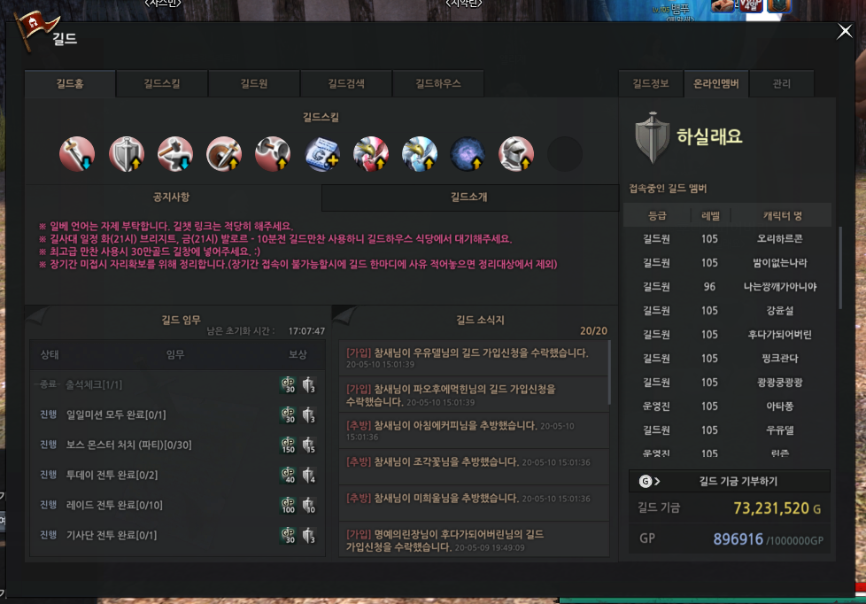

이 중에서 우리가 눈 여겨 봐야할 스킬 중에 하나가 길드 출정권 스킬이라고 생각함.

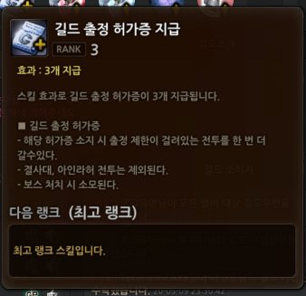

오전 9시에 초기화되는 스킬로 하루 제한이 있는 레이드나 전투 컨텐츠를 추가적으로 수행하게 해주는 아이템이라고 볼 수 있음. 

총 3장이 나오니까 이것을 잘 활용하는 것이 중요함.

일단, 각설하고 내가 생각하기에 필수적으로 돌아야한다고 생각하는 레이드나 전투들을 알려주고자 함.

1. 8 - 4종2순 (듀라한, 에스시더, 아르카나, 루파키투스)

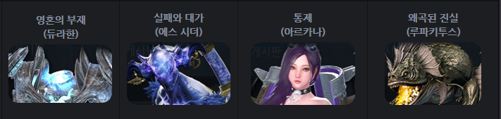

삡이 없다고 가정하면, 4종 1순만 될텐데 일단 있고 없고 따로 적기 귀찮아서 VVIP 버프가 다 있다고 가정하겠음. 

8은 매일 도는 것을 추천함. 주간 퀘를 통해서 귀속다마를 얻을 수도 있으며 거가다마도 득할 수 있음. 아주가끔 쌔복이 좋은 날에는 듀봉힘이 뜨고 아주 가끔 죽은자, 은은한이 나오기도 하니 꼭 돌자. 

2. 2닢 - 니플헤임 2순 

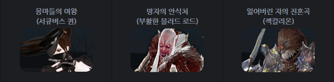

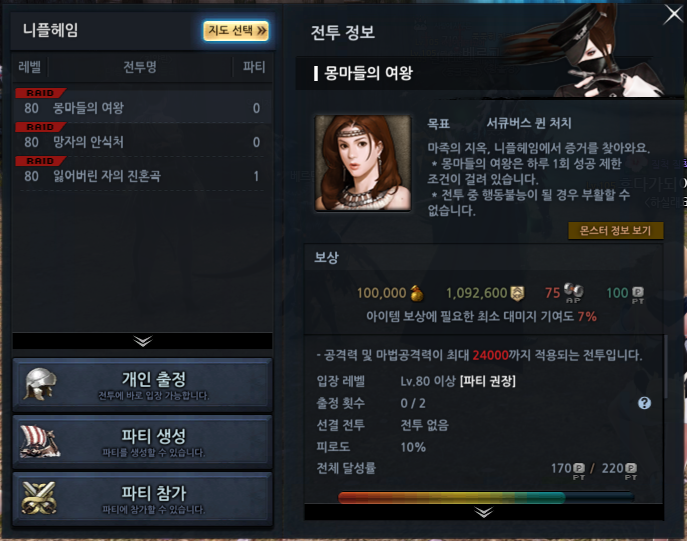

사용 피로도 : 30%

여기를 도는 이유는 다른 것보다는 준수한 AP와 클골을 주기 때문임. 
2닢을 가정하에 총 60만골의 클골과 450의 AP를 획득 할 수가 있음.

3. 요해히(12) - 요하드, 해비던트 히어로 6순

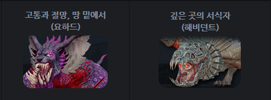

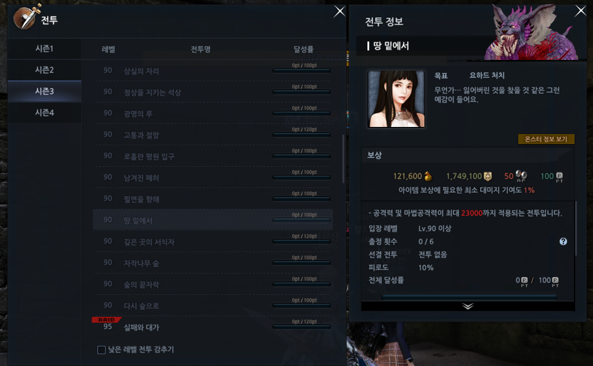

사용 피로도 : 60%

여기도 2닢과 비슷하게 준수한 AP와 클골이 있으며, 추가적으로 해봉힘, 요봉힘과 같은 물욕 득이 가능하고 보상 물품 중에서 상자에서 출정권을 득할 수 있어서 기사단이나 투탑을 추가적으로 또 돌 수 있는 기회가 생김. 

꼭 히어로로 돌아야하는 거 있지 말자!

레이드로는 이 정도를 매일 돌아주는 걸 추천함. 더 추천하자면, 앞서 말 한 투탑과 기사단 정도?

그렇다면 주간 컨텐츠가 무엇이 있을까? 

